# Commands in lldb
---

### Breakpoints

Stop running code and look around.

Inspect the state of the program with `po` "print object":

- print the value of something
`po self.navigationItem.rightBarButtonItem.title`

- call a method
`po [[NSUserDefaults standardUserDefaults] objectForKey:@"UserInfo.plaintextPassword"];`

^Start with basic stuff, breakpoints. 
`po` is an alias for `expression -O`, which invokes `description`.
For primitives in ObjC, use `p`; Swift more lenient because everything built-in has `description`
E.g., you can `po someInteger`

---

### Interpretations differ

Context for the debugger's interpreter depends on where you stop.

Stop in ObjC code: the debugger assumes you're entering ObjC.

**Swift code doesn't work**

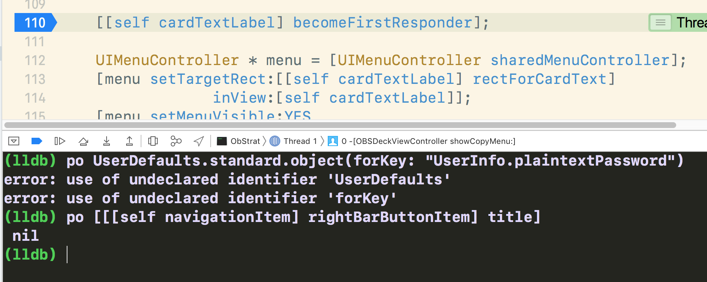

^We try to invoke a method using Swift syntax on `UserDefaults` and the interpreter is confused.
---

### Interpretations differ

Context for the debugger's interpreter depends on where you stop.

Vice-versa for Swift code

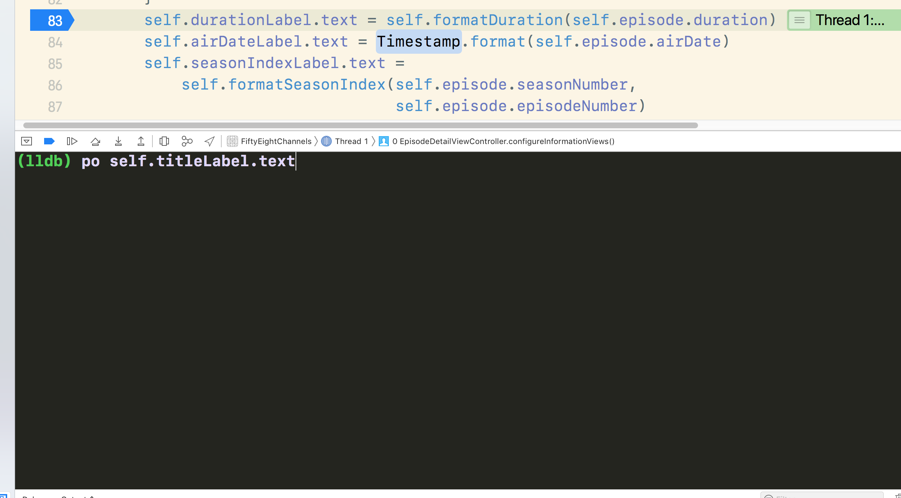

---

### Interpretations differ

Context for the debugger's interpreter depends on where you stop.

Vice-versa for Swift code: debugger recognizes Swift.

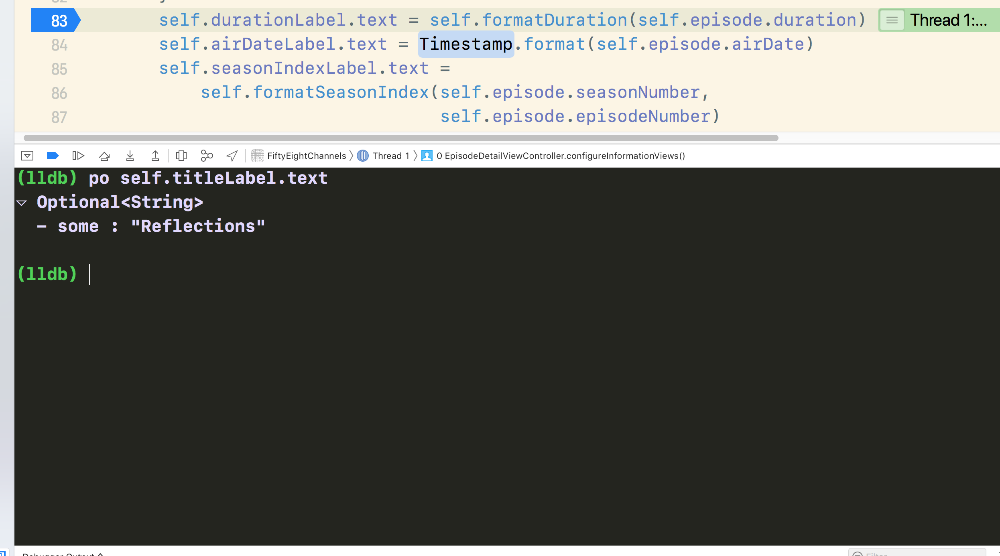

---

### Interpretations differ

Context for the debugger's interpreter depends on where you stop.

Vice-versa for Swift code: debugger recognizes Swift. **Not ObjC**.

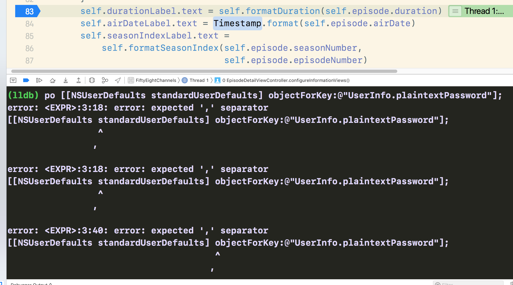

^Parser error here

---

### When you assume

If the program is paused at an arbitrary point, the debugger defaults to ObjC, _even if your entire app is written in Swift_.

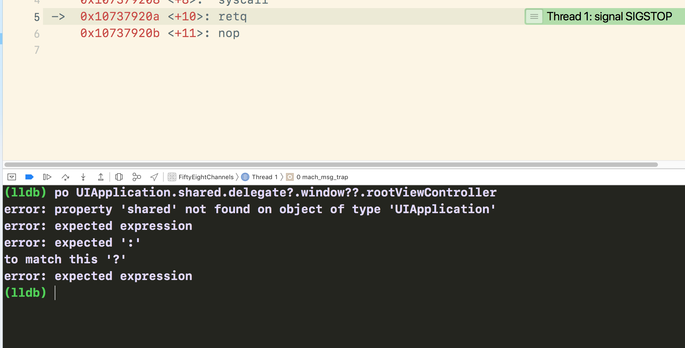

^_Even if your entire app is written in Swift_. Here we have a Swift expression, the parser does not know what to do with it.

---

### When you assume

If the program is paused at an arbitrary point, the debugger defaults to ObjC, _even if your entire app is written in Swift_.

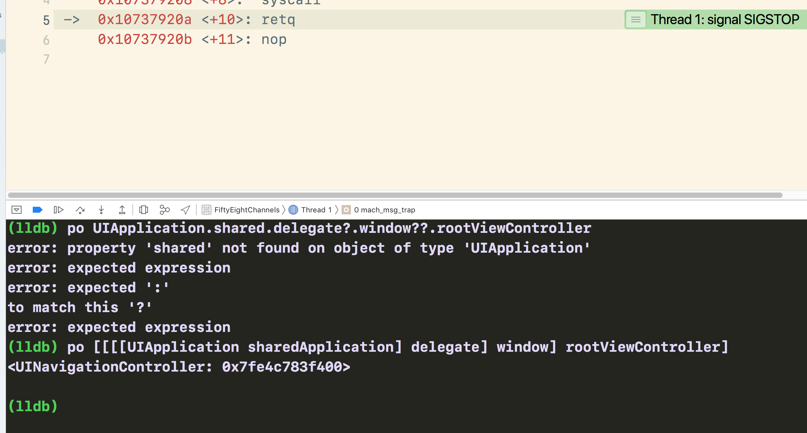

^The ObjC version of the same expression works fine.
So what can we do?

---

### Explicit language

The `expression` command can take a flag, `-l`, for the language you want to write:

- `-lswift`
- `-lobjc`

---

### Explicit language

Now we can write Swift expressions without being at a Swift breakpoint.

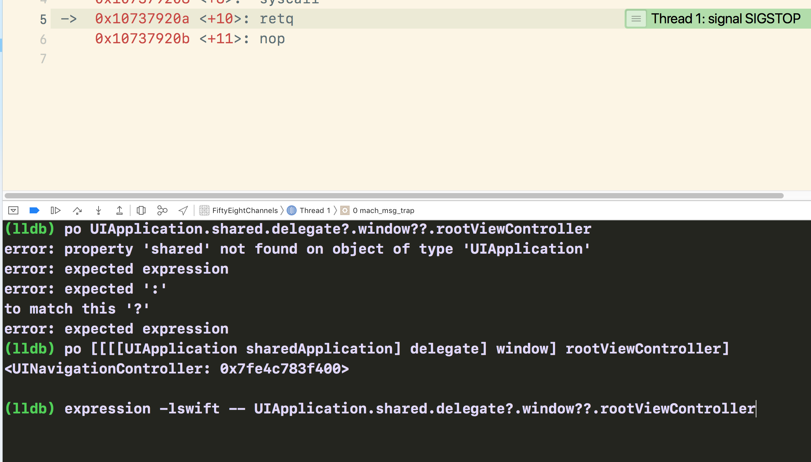

^Same pause location here, enter a Swift expression. The double dash separates the expression from the rest of the command
Buuuuut....

---

### Explicit language

N.B. It's not just the interpreter language: there's no Swift context at all.

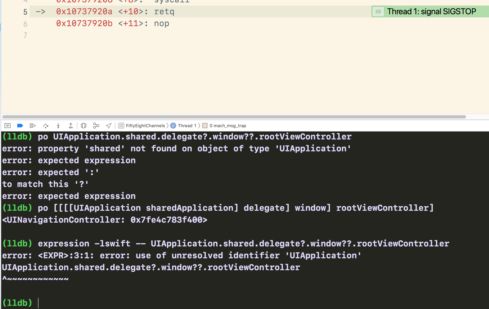

^Here we tried to access the root view controller, and it parsed, but UIApplication is not a known identifier

---

### Explicit language

You must import modules, e.g. `import UIKit`, `import MyApp` as needed.

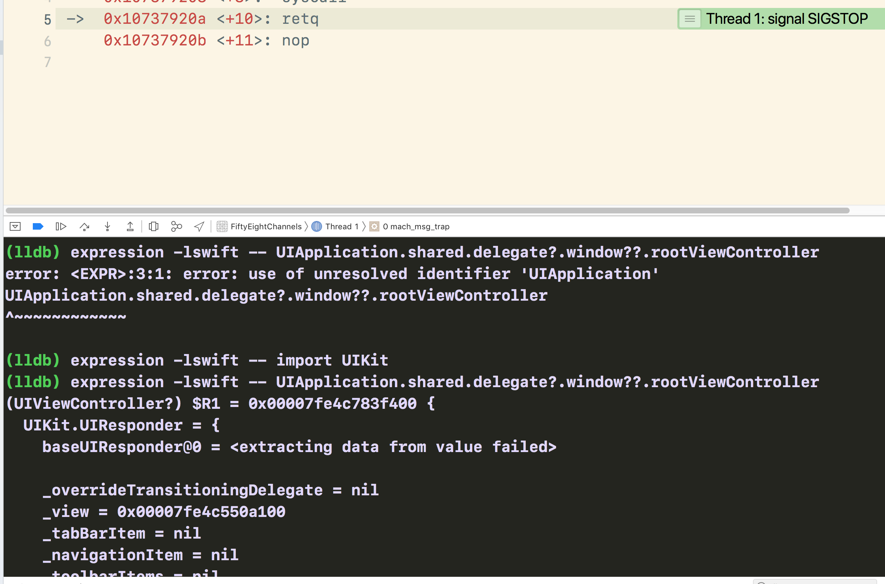

^And then you can type that expression

---

### Don't repeat yourself

Even with a short version of `expression`, it gets annoying having to retype

`ex -lswift -- Blah.blah.blah()`

every time.

^Any prefix of `expression` works, even down to just `e`

---

### Don't repeat yourself

Even with a short version of `expression`, it gets annoying having to retype

`ex -lswift -- Blah.blah.blah()`

every time.

**`lldb` allows us to save the command!**

---

### You name it

`command alias -- exs expression -lswift --`

Now when you type `exs` at the prompt,

`expression -lswift --`

is substituted.

^Syntax: "command alias" is what you're telling lldb to do.
Double dash separates any options. Then the alias name you want to use, here `exs`, then the substitution.
So now whatever you type after `exs` is evaluated as Swift, even when you're stopped in that ObjC context

---

### Short term memory

Aliases are cool, but

the debugger doesn't remember these aliases between sessions!

^Stop app, change some code, re-run and re-attach the debugger, anything you entered previously is gone.

---

### Short term memory

Aliases are cool, but

the debugger doesn't remember these aliases between sessions!

But it does have a "startup" file: ~/.lldbinit

^Has to be this special name. There are other locations that it looks as well; you can actually have one per-project too.

---

### Short term memory

Aliases are cool, but

the debugger doesn't remember these aliases between sessions!

But it does have a "startup" file: ~/.lldbinit

You can define your aliases there and they will always be available.

^In fact, any debugger command can go in there. It's run as a script at startup. We'll see another one later.

---

`command alias -h "Evaluate a Swift expression" -- exs expression -lswift --`

`command alias -h "Evaluate a Swift expression, stopping at existing breakpoints" -- exst expression -lswift -i0 --`

Useful project-specific shortcuts, too:

`command alias -- fetch-foo expression -lswift import FooKit; FooService.shared.fetchAllData()`

^Contents of my own .lldbinit
The `h` flag is for a help string; optional
The `i` flag is for "ignore breakpoints".
Normally `expression` will not stop at other breakpoints. With a false-y value for the `-i` flag, it will.
Commands to just execute specific things that you always find yourself typing again and again, pulling down messages

---

### Storage

When you evaluate an expression, the debugger shows the value with some gibberish.

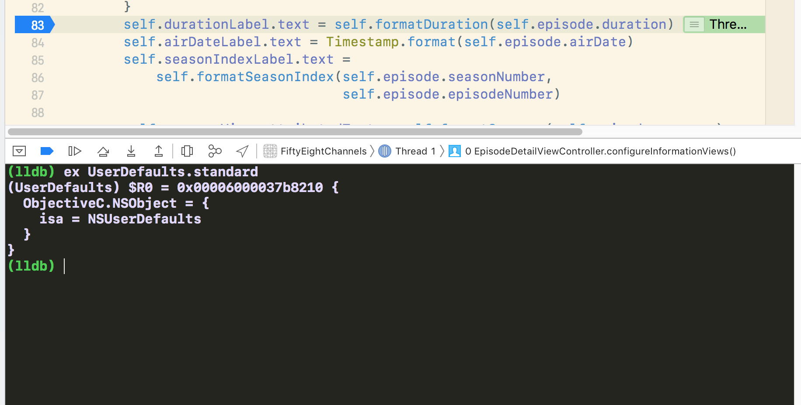

^Variable type first, address last. In between, $R0, what is this?

---

### Storage

Actually significant! `$R0` is now a name that you can use to refer to that value.

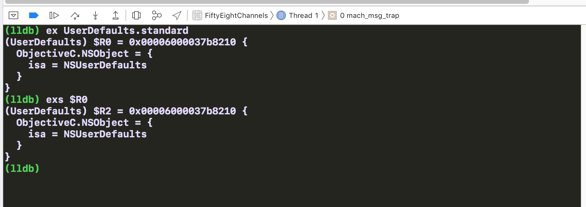

^This is persistent throughout the session. So if you were looking at a view controller that's on the nav stack, `po` it. Then push something else on the stack, that view controller is still accessible in $R#

---

### Storage

**You can also define your own names as part of an expression**

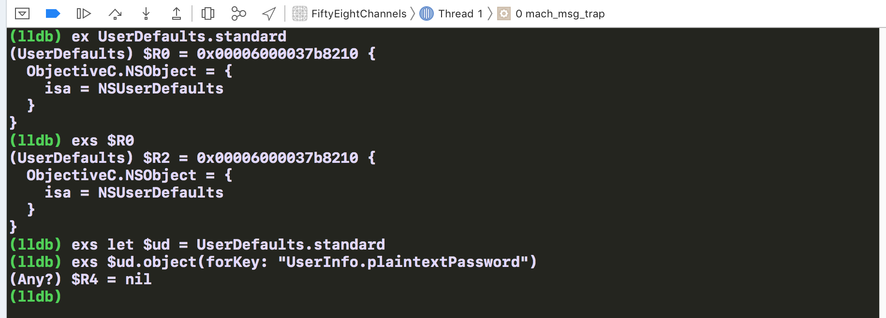

^Here we're writing a Swift expression, `let $ud = `, then we can use `$ud` again later in the session.

---

### Storage

**N.B. Your names must be prefixed with a dollar sign.**

Otherwise you won't be able to refer to them again.

^I believe this is to prevent collision with names in the program.
The debugger is very forgiving about re-defining existing names. Even a Swift `let` can be reassigned.

---

### NSLog(), NSLog() everywhere

Breakpoints don't actually have to stop.

^You can add some automation to breakpoints

---

### NSLog(), NSLog() everywhere

Breakpoints don't actually have to stop.

In this case, you probably want to give them an action.

---

### NSLog(), NSLog() everywhere

Breakpoints don't actually have to stop.

In this case, you probably want to give them an action.

Such as "print the value of something"

^This is a really easy alternative to adding prints or NSLogs to your actual code. You can easily turn them on and off individually or as a whole.

---

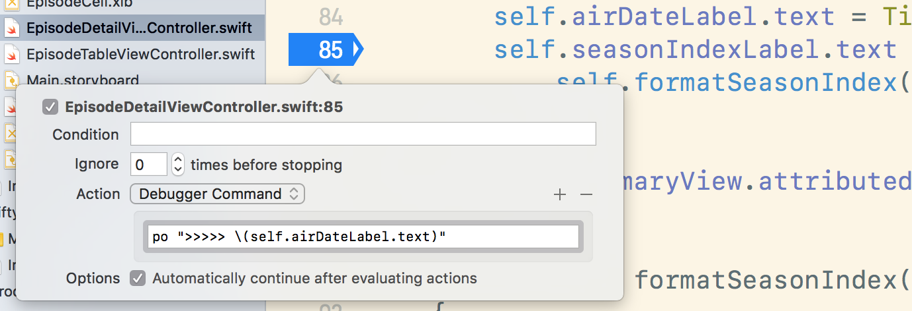

**Any debugger command works**

^Very simple,  configuring in Xcode. Checkbox to continue, print the value of a text field.

---

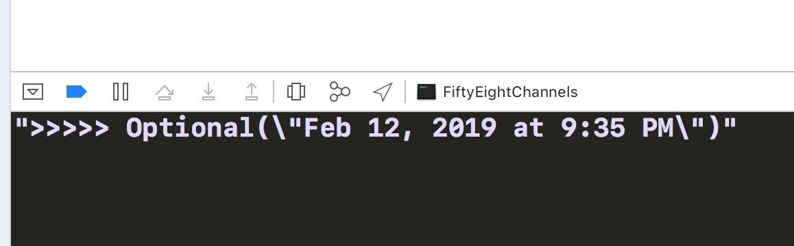

^And the results when running.

---

### With a mouse??

Breakpoints can be created in the Console (while stopped).

---

### With a mouse??

Breakpoints can be created in the Console (while stopped).

`breakpoint set`

^All lldb commands can be prefixes, so you can type "br" here

---

### With a mouse??

Breakpoints can be created in the Console (while stopped).

`breakpoint set`

Useful flags on `breakpoint set`:

`-f` file name

`-l` line number

`-G` "continue automatically"

`-C «debugger command»` "execute action"

^Last two for recreating what we did in the Xcode GUI

---

### With a mouse??

Simplest form is the alias `b «methodName»`, matches a pattern

Creates a breakpoint for every match.

---

### With a mouse??

Creates a breakpoint for every match.

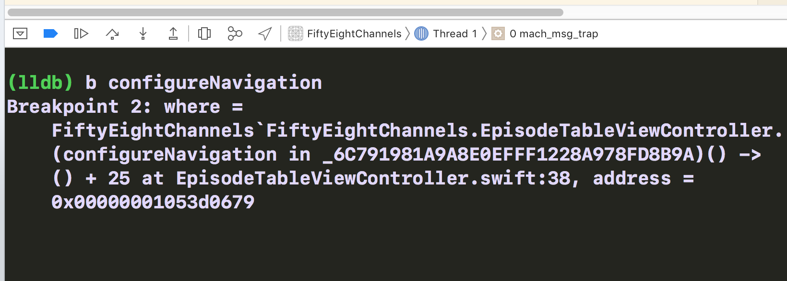

^Setting a breakpoint on a method in a particular class in the app.

---

### Matchmaker

Really, *every* match.

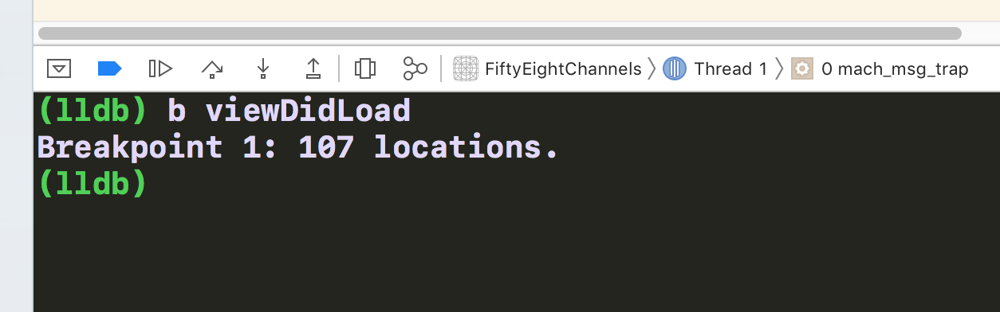

^This is matching `viewDidLoad` in the app, in UIKit, in any loaded modules.

---

### Matchmaker

We can use regular expressions (`rbreak` is another alias).

As before, creates a breakpoint on every match.

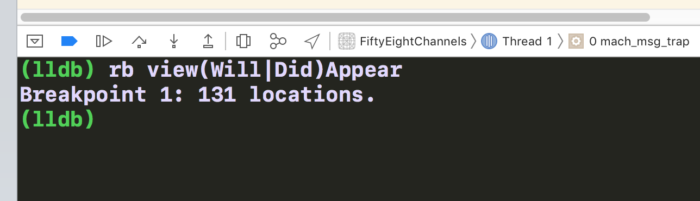

^Here we're setting breakpoints on any `viewWillAppear` or `viewDidAppear` symbols, again in *any* loaded module.

---

### Matchmaker

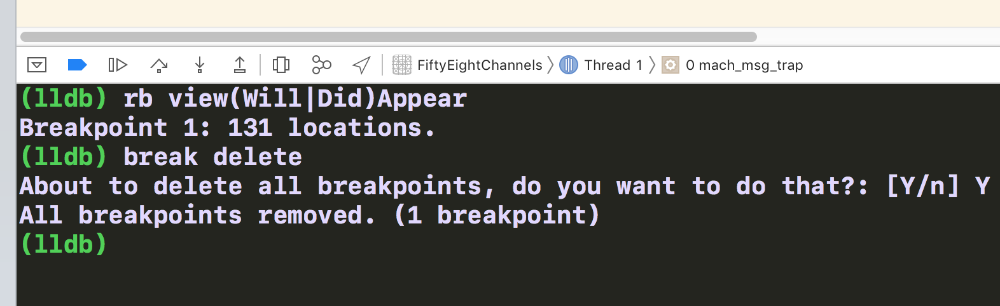

^Remove breakpoints in the console. Should mention that all lldb commands have great inline help. `help «commandname»` to figure out what options are available. And `help «commandname» «subcommand»` 

---

### Matchmaker

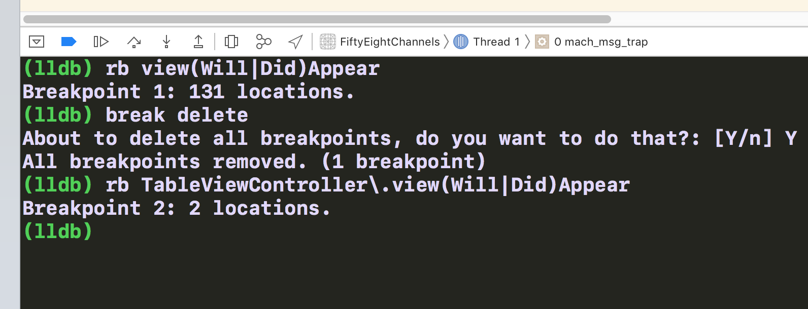

^Focus on a specific classname. What we're matching here is the symbol name that's in the binary. Since we used Swift syntax (the dot), we're only getting Swift methods. Use brackets and a space between the class name and method name for ObjC.

---

### Matchmaker

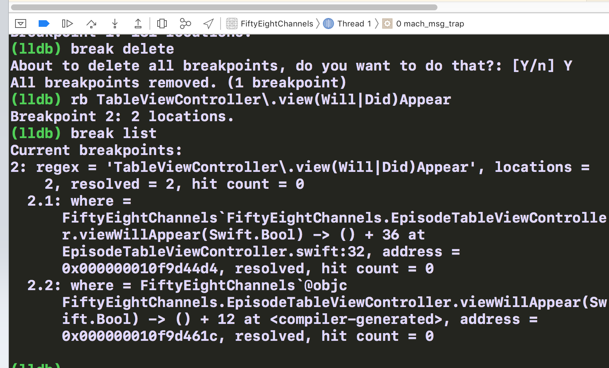

---

### Too simple?

More elaborate commands are possible

---

### Too simple?

More elaborate commands are possible

Regex substitution:

`command regex perform 's/(.+) (\w+)/expression -lswift -O -- %1.perform(NSSSelectorFromString("%2"))/`

^Similar syntax to the `alias` command. Tell lldb `command regex` then the name of the command. Then normal regular expression substitution, s-slash, pattern, slash, and then the replacement. Capture groups have percent signs

---

### Too simple?

More elaborate commands are possible

Regex substitution:

`command regex perform 's/(.+) (\w+)/expression -lswift -O -- %1.perform(NSSSelectorFromString("%2"))/`

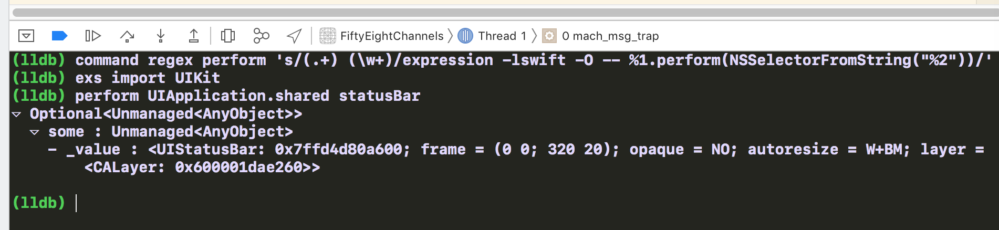

^`statusBar` is private API.
I need to mention that this example is taken straight from a book that I'm going to recommend at the end.

---

### Too simple?

More elaborate commands are possible

Python scripting!
Define a Python module, invoke functions within

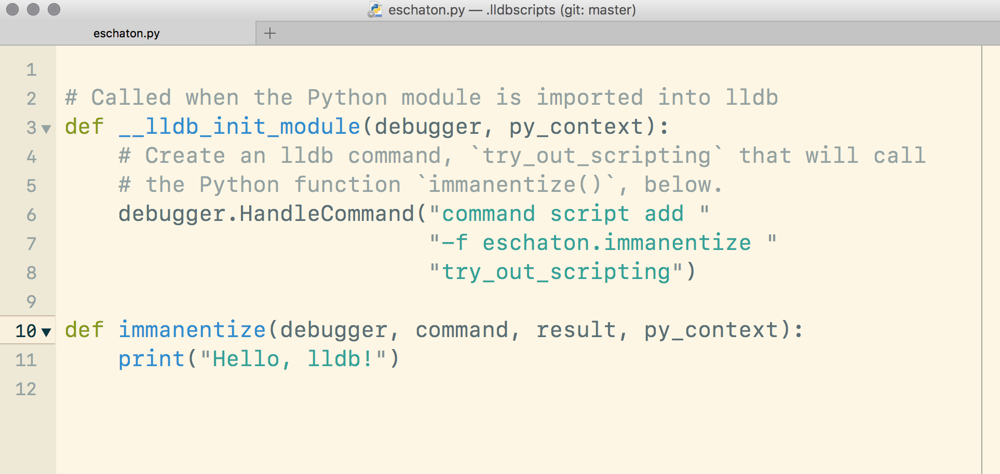

^Most control

---

### Ahh! Snake!

^init module function gets debugger context passed in. It can be used to change the debugger's state. Common task is to add a python function as a command, as here. `-f «function»`, then name that will be used in the debugger.
Parameters of invoked function: debugger object, command string, result pass back, Python runtime context

---

### Ahh! Snake!

Add the import to .lldbinit

`command script import ~/.lldbscripts/eschaton.py`

---

### Ahh! Snake!

Now you can invoke the function by the given command name.

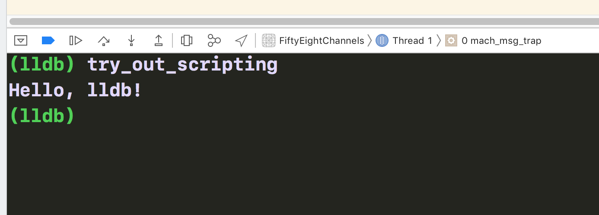

^Very simple example

---

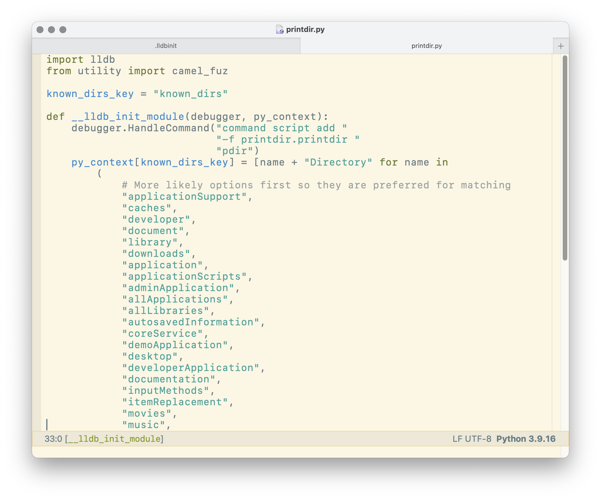

^This ties everything together. Here we have a Python lldb module that creates a command `pdir`. This invokes a Python function `printdir`...

---

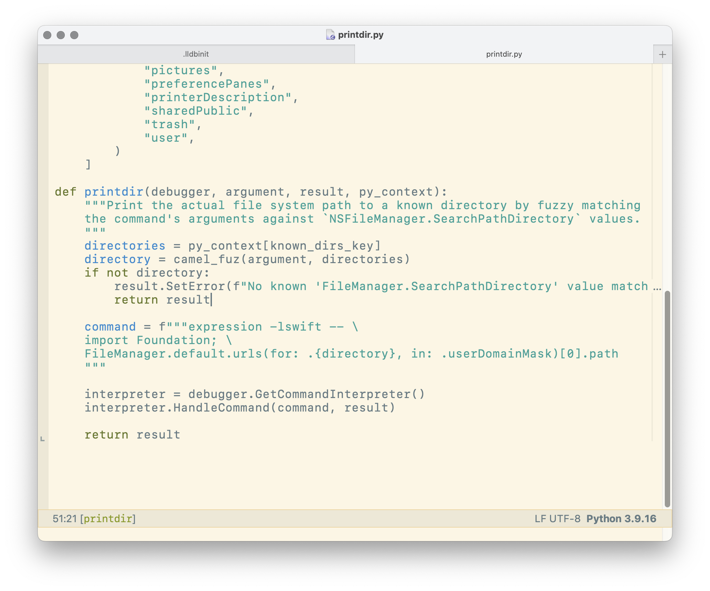

^The `printdir` function accepts some input that looks like a system directory and evaluates it via `FileManager` to give you the full path -- useful in the sim.
Run commands, read state, look at stack frames, full access to the debugger _plus_ Python

---

### Carry on, Inspector

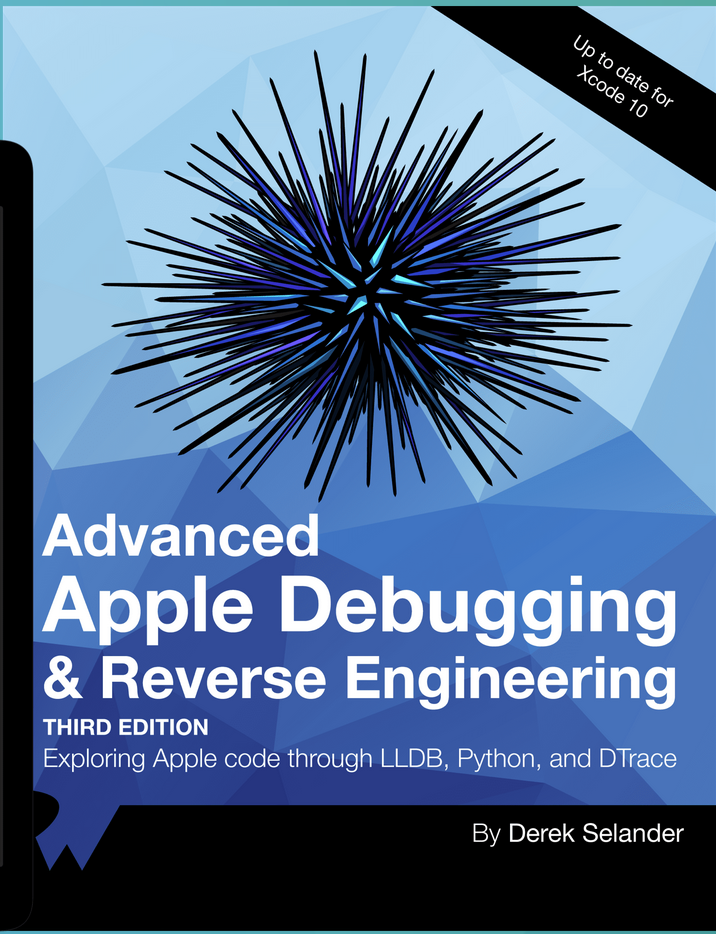

^If this stuff seems fun or interesting, you should check out this book. I learned a bunch of this from it, especially the scripting parts.
